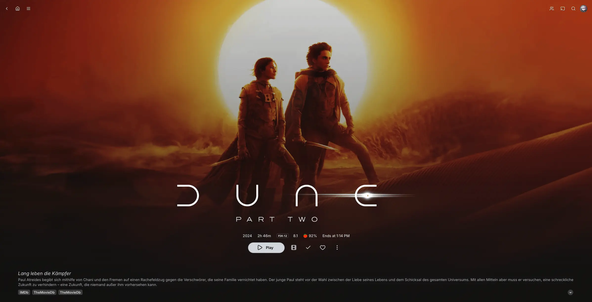
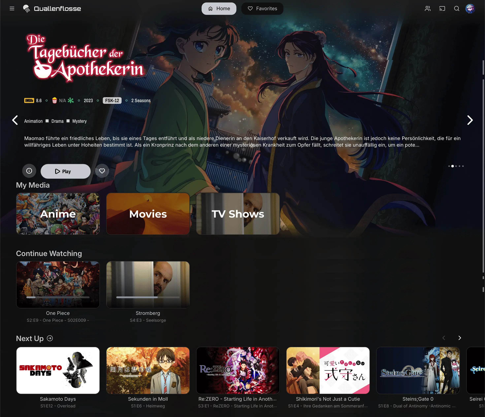
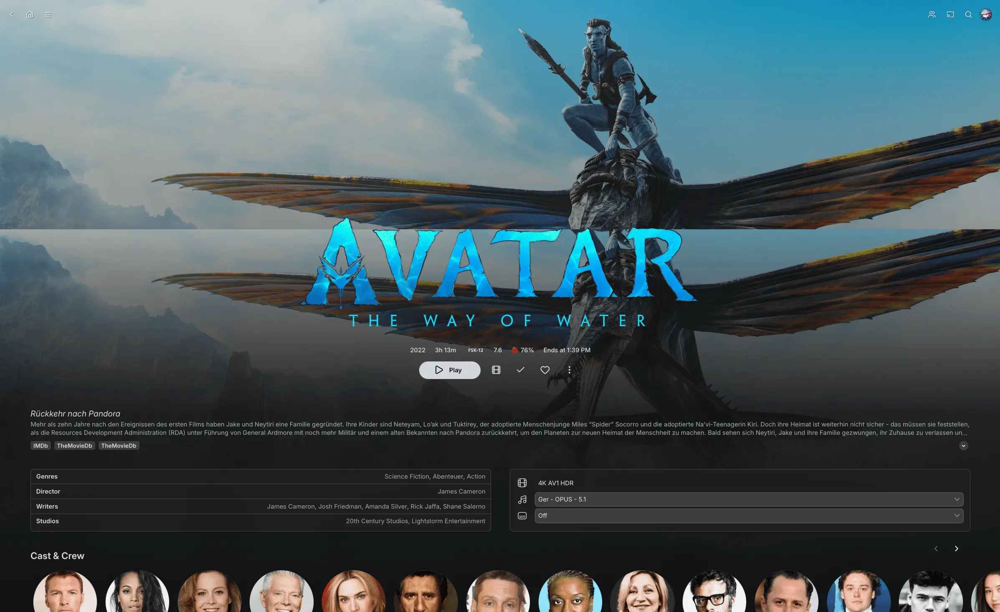
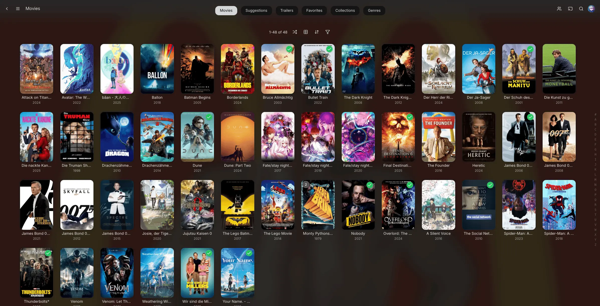
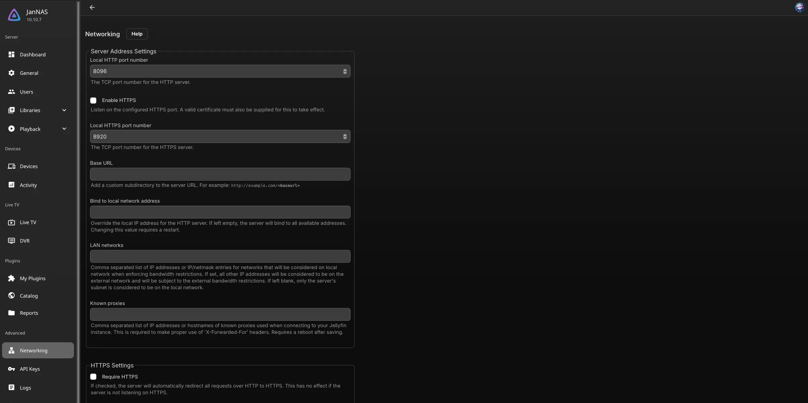

<p align="center">
  
</p>

<hr />

A Jellyfin theme: the dark, low-contrast base of
[NeutralFin](https://github.com/KartoffelChipss/NeutralFin) with a pastel
lavender accent and Google Sans throughout. NeutralFin itself builds on
[ElegantFin](https://github.com/lscambo13/ElegantFin).

Looks best with backdrops enabled in your Jellyfin settings. The previews also
use [Jellyfin Lucide](https://github.com/KartoffelChipss/Jellyfin-Lucide) for
its icons.

### Install

Paste this into a **Custom CSS** field:

```css
@import url('https://cdn.jsdelivr.net/gh/zekurio/PastelFin@main/theme/pastelfin-minified.css');
```

Server-wide, for every user: **Settings** → **Administration** → **General** →
**Branding** → **Custom CSS**, then save. For your account only: **Settings** →
**Display** → **Custom CSS**, then save.

### Customization

Override any variable below the `@import`. `--accentColor` carries text, icons,
progress bars, and focus rings; `--accentColorStrong` fills surfaces that sit
under light text, so keep it the darker of the two.

```css
:root {
    --accentColor: #b39ddb;
    --accentColorStrong: #9273c9;

    /* Use your instance's splashscreen as the login background */
    --loginPageBgUrl: url('/Branding/Splashscreen?format=webp&foregroundLayer=1&quality=33&width=3840&height=2160&blur=2');
    --loginPageText: 'Sign in to continue';
}
```

For NeutralFin's fully neutral look, point both accents at a grey
(`rgb(130, 130, 130)` / `rgb(100, 100, 100)`). To dial the tint back further,
restore upstream's green play buttons with `--btnMiniPlayColor: rgb(41, 154, 93)`
and `--btnMiniPlayBorderColor: rgb(50, 167, 105)`, and flatten the chrome with
`--darkerGradientPoint: #131313`, `--lighterGradientPoint: #1e1e1e`,
`--headerColor: rgba(40, 40, 40, 0.5)`, `--drawerColor: rgba(40, 40, 40, 0.9)`,
`--borderColor: rgb(71, 71, 71)`, and
`--selectorBackgroundColor: rgb(60, 60, 60)`.

### Updating

jsDelivr caches the file at its edge for 12 hours and browsers hold it for 7
days. A `?v=` query string does **not** bust the CDN cache, only the browser
one, so do both — purge first, then bump:

```bash
curl "https://purge.jsdelivr.net/gh/zekurio/PastelFin@main/theme/pastelfin-minified.css"
```

```css
@import url('https://cdn.jsdelivr.net/gh/zekurio/PastelFin@main/theme/pastelfin-minified.css?v=2');
```

Bumping before purging just refetches the same stale bytes under a new URL.

### Previews

<details>
  <summary><strong>Home</strong></summary>



</details>

<details>
  <summary><strong>Movie</strong></summary>



</details>

<details>
  <summary><strong>Movie list</strong></summary>



</details>

<details>
  <summary><strong>Dashboard</strong></summary>



</details>

### Credits

PastelFin adds the lavender accent, tints the chrome greys (app bar, drawer,
borders, selectors, background) toward that hue, carries the accent onto play
buttons, and swaps the type stack to Google Sans and Google Sans Code.

NeutralFin by [KartoffelChipss](https://github.com/KartoffelChipss) contributed
the neutral black and grey scheme, the themed login card, media bar fixes, and
assorted CSS refinements, on top of ElegantFin by
[lscambo13](https://github.com/lscambo13).

Not affiliated with or endorsed by the Jellyfin project. Media shown in the
previews belongs to its respective copyright holders and ships with nothing
here.

### License

[GPL-2.0](LICENSE)
